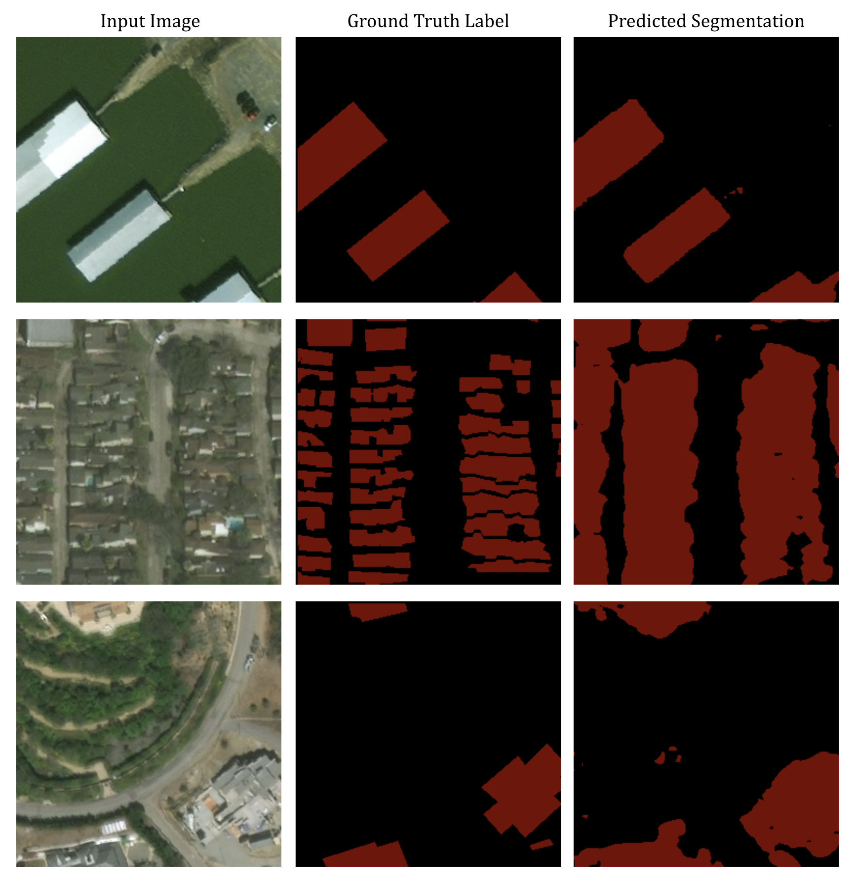
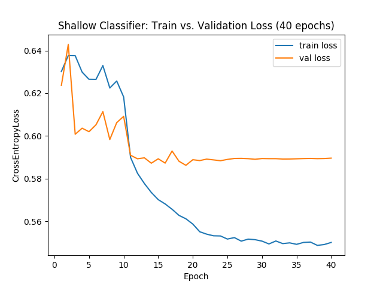

# cv-semantic-segmentation

## Overview

This project implements the zoom-out feature approach to semantic segmentation with Convolutional Neural Networks as laid out by [Mostajabi et al. (2015)](https://www.cv-foundation.org/openaccess/content_cvpr_2015/papers/Mostajabi_Feedforward_Semantic_Segmentation_2015_CVPR_paper.pdf).

With limited access to GPU hardware, this project simplifies upon the paper's approach in at least one key way. Instead of averaging hypercolumns over superpixels, I randomly sample a few (3) pixel-wise hypercolumns for use in the shallow classifier. Implementing superpixels is a likely next step for this project.

The data source for this project is the [xView2](https://xview2.org/) dataset of satellite imagery, originally provided as part of a challenge to predict the extent of natural disaster damage. Again, due to hardware limitations, I've split each 1024x1024 image into 16 separate 256x256 images.

## Initial results

<p align="center">
    
    <i>From left to right: (1) input image, (2) input labels, (3) predicted segmentation</i>
</p>

From even just 3 epochs of training, the classifier does pretty well if it can segment on color, as in the top row. It misses out on finer details or densely-packed shapes, as with the second row. It also has trouble disambiguating buildings from roads or other brightly-colored features with high contrast to the ground near to them, as with the third row.

Currently, my best results have been from using the following features and hyperparameters:
- Zoomout features: using activations for all 13 convolutional layers in VGG16, giving a 4755-element feature vector for every pixel.
- Class weights for Cross Entropy Loss: Using inverse weights from the true distribution of `[0.05, 0.95]` for labels `[0, 1]` respectively
- Optimizer: Adam with a learning rate of 0.001 and no learning rate decay
- Shallow classifier is trained for 40 epochs, with a plateau in loss curves around the 20-epoch mark
- Dense classifier is trained for 3 epochs. I will update this repo as I get more consecutive rounds of training in.

<p align="center">
    <br>
    <i>Loss curves for the shallow classifier trained over 40 epochs (result of `train_cls.py`)</i>
</p>


## Directory Structure

```
.
├── data: holds definition for dataloader class
├── features: holds intermediate features (e.g. embeddings)
├── nets: holds class definitions for neural net classifiers
├── utils: other useful preprocessing and bash utility scripts
├── run.sh: script submitted to SBATCH on server
├── sampling.py: extracts hypercolumn features from data and saves to /models
├── train_cls.py: loads saved hypercolumn features and trains shallow FC classifier
└── train_seg.py: loads weights from FC classifier into 1x1 CNN kernel and trains a dense classifier on images.
```

## How to run

A full training sequence from scratch has 3 main steps:

1. Run `sampling.py` to extract intermediate features from images.
2. Run `train_cls.py` to train the fully-connected classifier on the intermediate features.
3. Run `train_seg.py` to load pre-trained weights from the fully-connected classifier and use them to generate semantic segmentation predictions.

*Note:* I only had access to 4 hours of GPU training at one time, which is sufficient for about 3 full epochs. I got around this by saving the model state after each run, and having the model load the saved state at the start of the next training run. You can do this by running `train_seg.py` with the `--load_saved_model` argument set to `True`. If set to `False`, the classifier will be trained from scratch.

## Hyperparameter and architecture tuning

- Inverse class weights: reflecting true class counts or manually set
- Pretrained model to use for zoomout layers: VGG11 or VGG16
- Number of zoomout layers to use: `Conv2d` layers before pooling layers or all `Conv2d` layers in general
- Optimizer: SGD or Adam
- Learning rate: 0.01, 0.001, 0.0001 as starting point
- Learning rate decay: Using step decay and gamma = 0.1, step size = 10 or 20
- With and without dropout layers in the shallow fully-connected classifier  
